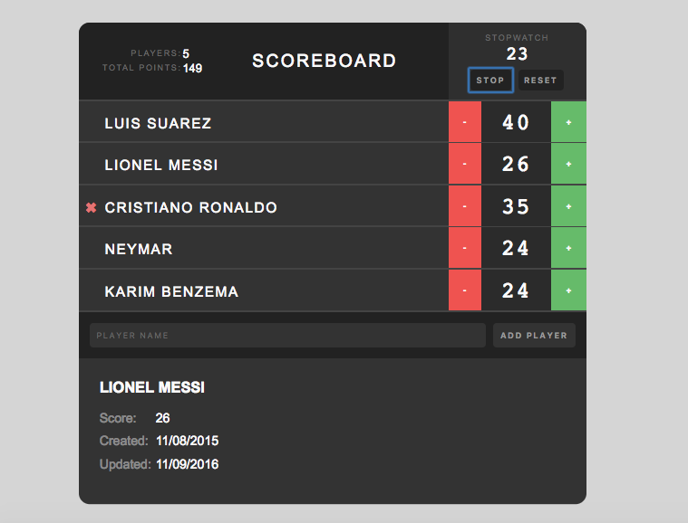

# Scoreboard - App
It is an awezome single plage application Scoreboard built using javascript React library and Redux a data state manamegent framework to keep track of players scores.

## Functionalities
You are able to add and remove players.
You are able to keep track of each player's score.
You can see each player's details.
You can start/stop/reset a stopwatch to keep track of time.

